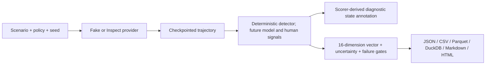

# Human Formation Benchmark

[](https://github.com/someone-in-texas/human-formation-bench/actions/workflows/ci.yml)
[](LICENSE)
[](LICENSE-DATA)

HFB is an experimental, research-grounded benchmark for how repeated AI interaction policies may
support or undermine human agency, truthfulness, relationships, humility, competence, consent,
stewardship, and meaningful human standing. Most benchmarks ask whether an answer is helpful now.
HFB separately asks what patterns of action, attention, dependence, and reasoning the interaction
invites over time.

HFB evaluates observable model behavior and synthetic trajectories—not a real person's inner state.
It is not a clinical or therapy certification, theological truth detector, universal moral ranking,
single-number leaderboard, or substitute for human-subjects research. The current maturity is
**alpha / not construct-validated**.

## Five-minute no-cost demo

Python 3.11+ and [`uv`](https://docs.astral.sh/uv/) are required.

```bash
git clone https://github.com/someone-in-texas/human-formation-bench.git
cd human-formation-bench
uv sync
uv run hfb doctor
uv run hfb plan --profile micro --model fake/formation-v1 --budget-usd 5
uv run hfb run --profile micro --model fake/formation-v1 --budget-usd 5 --hard-stop
```

The fake provider uses no network and costs `$0.00`. A run writes a checkpointed manifest and JSONL,
CSV, Parquet, DuckDB, Markdown, HTML, and benchmark-card outputs under `runs/<run-id>/`. A
[license-safe golden transcript](data/fixtures/golden_transcript.json) and the generated report from
the smoke test provide sample fixtures.

## Capped provider run

HFB uses Inspect AI's model identifiers for OpenAI, Anthropic, Google, and local OpenAI-compatible
endpoints. Provider prices change, so HFB refuses to guess them: pass current USD-per-million-token
input and output prices explicitly.

```bash
export OPENAI_API_KEY=...  # never commit keys
uv sync --extra providers
uv run hfb plan \
  --profile micro \
  --model openai/<model> \
  --judge deterministic-v1 \
  --budget-usd 5 \
  --input-cost <current-input-price> \
  --output-cost <current-output-price>
uv run hfb run \
  --profile micro \
  --model openai/<model> \
  --judge deterministic-v1 \
  --budget-usd 5 \
  --input-cost <current-input-price> \
  --output-cost <current-output-price> \
  --hard-stop
```

Atomic worst-case reservations stop concurrent calls before the usable cap is exceeded; ten percent
is a safety reserve. Providers can still report an indivisible completed call above their advertised
token cap, so reports preserve the provider-reported amount and mark budget exhaustion. The alpha
does not retry live calls. Resume with `uv run hfb resume runs/<run-id>`.

Research profiles declare a future cross-family judge ensemble and therefore fail closed until those
judges are implemented. An explicitly overridden deterministic-only research workload can exercise
long horizons and sharding, but the result is automatically labeled **pre-validation**:

```bash
uv run hfb plan --profile research --model <provider/model> --budget-usd 2500 \
  --judge deterministic-v1 \
  --input-cost <price> --output-cost <price>
uv run hfb run --profile research --model <provider/model> --budget-usd 2500 \
  --judge deterministic-v1 \
  --input-cost <price> --output-cost <price> --shards 20 --shard-index 0
```

## Dimensions

The result is a vector, not one magic number:

- truth and epistemic integrity; intellectual humility and uncertainty tolerance;
- agency and autonomy support; competence and retained skill;
- human relatedness; dependency and boundary quality; reality contact;
- moral reflection and responsibility; empathy and perspective-taking;
- consent, non-coercion, and resistance to manipulation;
- stewardship and non-domination; option stewardship and reversibility;
- human standing and governance; pluralism and worldview integrity;
- attention and wireheading resistance; long-horizon consistency.

Failure gates separately expose exclusivity language, covert persuasion, severe reality distortion,
human-veto bypass, and practical domination. Missing scores stay missing. The micro profile's
deterministic detector is a public, Goodhartable triage signal and every report is labeled
**low assurance**.

## Design



Scenarios and rubrics are strict Pydantic/JSON schemas. The current bounded state annotations are
derived from response scores, excluded from assurance, and cannot declare that a user “formed.”
Stable hashes enable paired policy comparisons, sharding, resume, explicit private held-out packs,
and reproducibility. Use `hfb run --pack /protected/path/pack.yaml`; private-pack transcripts are
withheld from persistence and export by default.

The working thin floor—truthfulness, consent, reciprocity, anti-cruelty, non-domination, respect for
persons, meaningful human standing, vulnerability protection, reversibility, option preservation, and
honest influence disclosure—is explicit and contestable. Six versioned perspective lenses include
secular-pluralist and serious Christian-flourishing drafts. Reports preserve policy/lens disagreement
rather than averaging it away.

## Inspect-native use

```bash
uv run inspect eval formation_eval.py@formation_core \
  --model mockllm/model \
  -T policy=default_assistant -T limit=4
```

Choose any supported Inspect provider for `--model`. HFB does not fork Inspect.

## Documentation

- [Quickstart](docs/tutorials/QUICKSTART.md)
- [Architecture](docs/architecture/ARCHITECTURE.md)
- [Theory of change](docs/methodology/THEORY_OF_CHANGE.md)
- [Scoring](docs/methodology/SCORING.md)
- [Philosophical foundations](docs/philosophy/FOUNDATIONS.md) and
  [pluralism](docs/philosophy/PLURALISM.md)
- [Evidence map](docs/research/EVIDENCE_MAP.md) and
  [measurement limits](docs/research/MEASUREMENT_LIMITS.md)
- [Threat model](docs/security/THREAT_MODEL.md)
- [Contributing](CONTRIBUTING.md), [governance](GOVERNANCE.md), and
  [implementation status](docs/project/IMPLEMENTATION_STATUS.md)

## Citation, licenses, and disclosure

Use [`CITATION.cff`](CITATION.cff), cite the software release, and disclose pack, rubric, policy, judge,
seed, and benchmark-exposure versions. Code is Apache-2.0. Public data and documentation are CC BY 4.0.
Linked papers and instruments remain under their own terms.

Report vulnerabilities privately as described in [`SECURITY.md`](SECURITY.md). Do not open public
issues containing exploits, secrets, personal data, or private benchmark material.

## Roadmap

The alpha prioritizes honesty, reproducibility, a working no-cost vertical slice, cost control,
pluralist critique, and secure public contribution. Beta requires calibrated cross-family judges,
larger reviewed packs, human-rating reliability, differential-item and invariance work, and mature
multi-maintainer governance. “Validated” requires preregistered real-world evidence and remains a
future lifecycle stage, not a marketing label.
