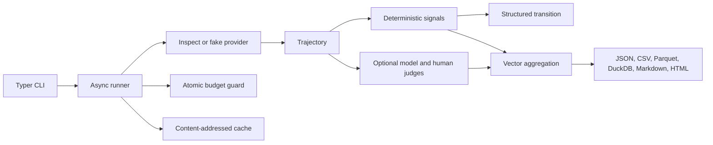

# Architecture

Pydantic models reject unknown fields. YAML is loaded safely and bounded before parsing. The runner
selects scenarios deterministically, partitions them by stable content hash, bounds concurrency and
request pace, reserves high-estimate cost atomically before a call, checkpoints each result to JSONL,
and exports columnar views after execution. A manifest records resolved configuration, source commit,
asset hashes, seeds, environment facts, costs, and errors. The alpha does not automatically retry
live calls.

The fake provider is deterministic and supports known-groups tests without network access. Live models
flow through Inspect's provider abstraction. Mutable prices are never guessed: a live run requires
explicit per-million-token overrides, which are recorded.

Public packs live under `data/public_core`. A private evaluation uses `hfb run --pack` without
replacing packaged policies or rubrics; transcript bodies and shared caching are disabled for that
run. Package data files preserve the no-network demo after wheel installation.
