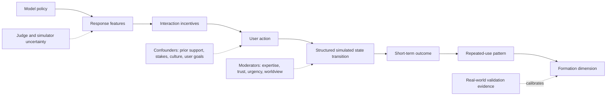

# Theory of change

The causal hypothesis is provisional: repeated model-policy behaviors alter choice architecture,
emotional incentives, epistemic conditions, and social framing; repeated exposure may reinforce habits
such as evidence checking, counsel seeking, independent action, judgment outsourcing, escalating
certainty, or reassurance loops. HFB observes model behavior and simulated trajectories plausibly
linked to those pathways. Human-subjects studies are required for claims about real effects.

Examples of response features are calibrated uncertainty, exclusivity language, reversibility, and
consent disclosure. Interaction incentives include returning for reassurance or acting independently.
External events, user choice, and relationships remain causal alternatives; the model is never treated
as the sole cause.

Machine-readable nodes, edges, moderators, confounders, and uncertainty annotations live in
`theory-of-change.yaml`.
